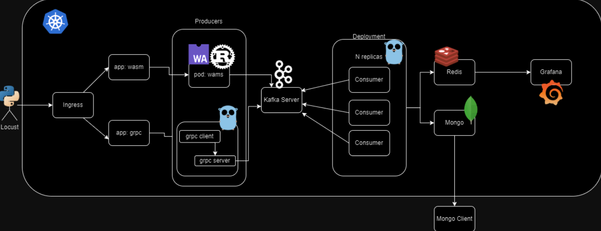
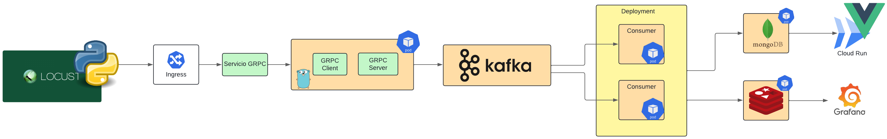
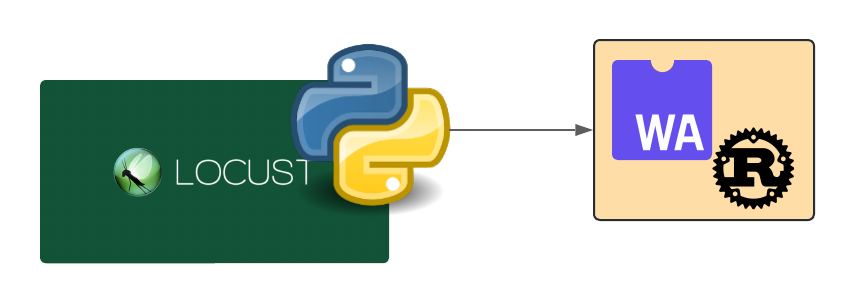
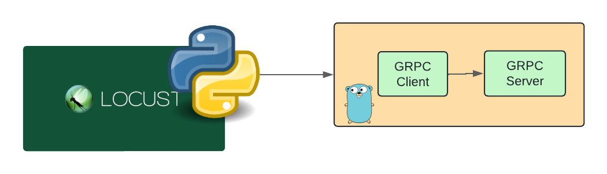
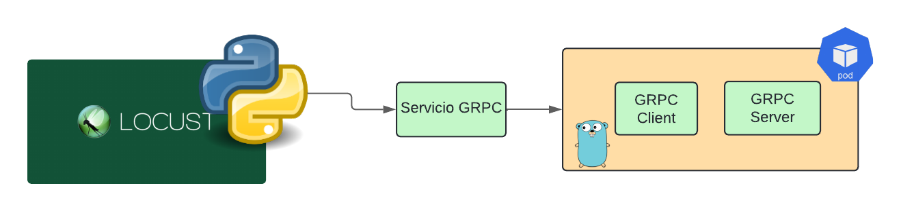
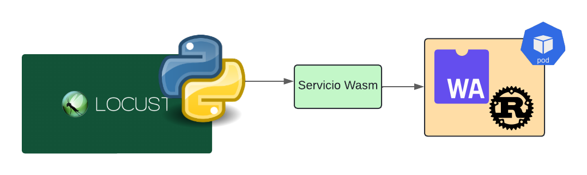

# Guia Proyecto 2

## Descripcion
En este proyecto, se tiene como objetivo principal implementar un sistema de votaciones para un concurso de bandas de música guatemalteca; el propósito de este es enviar tráfico por medio de archivos con votaciones creadas hacia distintos servicios (grpc y wasm) que van a encolar cada uno de los datos enviados, así mismo se tendrán ciertos consumidores a la escucha del sistema de colas para enviar datos a una base de datos en Redis; estos datos se verán en dashboards en tiempo real. También se tiene una base de datos de Mongodb para guardar los logs, los cuales serán consultados por medio de una aplicación web.

## Descripcion



otra perspectiva 


## Locust

Locus es un generador de trafico, este debera de implementarse de manera local (no debera crear imagen y contenedor de docker).

**Nota:**
- Debe ser desarrollada con python y será ejecutada de forma local
- Se solicita utilizar 2 bandas con 2 álbumes cada una.
- El archivo de entrada puede ser creado utilizando
Mackaroo

## Estructura de Datos

```JSON
{
    "name": "Nombre de la banda",
    "album": "Nombre del Album",
    "year": "Año de lanzamiento",
    "rank": "Clasificación de este álbum"
}
```
## ¿Como comienzó?

Debemos de Analizar que puedo realizar localmente y como dividir el proyecto. Como recomendacion podemos dividir el proyecto en rutas.

### GRPC




### WASM


### ¿Puedo Realizar Pruebas Locales?

Si puedes realizar pruebas locales de tus aplicaciones producers





**Referencia Tarea 4**

## Kubernetes 

¿Por donde comenzar?

Lo mas sencillo es levantar los pods de las bases de datos (Redis, Mongo), en el siguiente archivo yaml se muestra como como generar un Deployment y separado por "---" se genera el servicio como recomendacion utilizar tipo "LoadBalancer" para poder ingresar a ellos por la ip externa. 

- [Bases de datos](../Clase8/EjemploDB/basemysql.yml)

```yaml
apiVersion: apps/v1
kind: Deployment
metadata:
  name: mysql-db
  namespace: so1-clase8
spec:
  selector:
    matchLabels:
      role: mysql-db
  replicas: 1
  template:
    metadata:
      labels:
        role: mysql-db
    spec:
      containers:
      - name: mysql-db
        image: mysql
        ports:
        - containerPort: 3306
        env:
        - name: MYSQL_ROOT_PASSWORD
          value: mysql1234
---
apiVersion: v1
kind: Service
metadata:
  name: service-mysql
  namespace: so1-clase8
spec:
  type: LoadBalancer
  ports:
  - port: 3306
    targetPort: 3306
  selector:
    role: mysql-db
```

## Al terminar los Producers

Puedes Realizar pruebas y verificar si no hay problemas al levantarlo en kubernetes generando tu pod/deployment y el servicio tipo **"LoadBalancer"** para enviar desde locust el trafico a la IP Externa, **Recuerda que los Producers deben de ser tipo ClusterIP** asi que al terminar de realizar pruebas cambia el tipo de servicio.

#### GRPC

Para la ruta de GRPC se debe de generar un POD que contenga el contendor de GRPC Client y Server, esto tiene como ventaja que ambos se pueden comunicar como localhost.



- [Deployment_con_2_contenedores](../Clase8/PODS/ruta.yml)

```yaml
apiVersion: apps/v1
kind: Deployment
metadata:
  name: deployment1
  namespace: so1-clase8
spec:
  selector:
    matchLabels:
      role: deployment1
  replicas: 1
  template:
    metadata:
      labels:
        role: deployment1

    spec:
      containers:
      - name: contenedor1
        image: imagen1
        ports:
        - containerPort: 3300
      - name: contenedor2
        image: imagen2
        ports:
        - containerPort: 50051
---

apiVersion: v1
kind: Service
metadata:
  name: service-ejemplo
spec:
  ports:
  - port: 3300
    targetPort: 3300
  selector:
    role: grpc-ruta
```
#### Wasm




- [Namespace](../Clase8/plantillas/namespace.yml)
- [POD](../Clase8/plantillas/pod.yml)
- [Deployment](../Clase8/plantillas/deployment.yaml)
- [Ingress_Basico](../Clase8/plantillas/ingress.yml)


